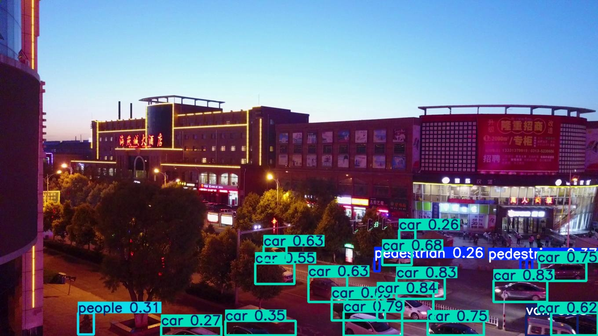

# 🚁 YOLOv11 在 VisDrone 数据集上的使用 (YOLOv11 on VisDrone)

## 1\. 📝 项目简介

本项目旨在将最新的单阶段目标检测算法 **YOLOv11** 应用于 **VisDrone** 无人机视角数据集。实验目标是评估 YOLOv11 在处理该数据集特有的**密集小目标**和**复杂俯视场景**时的基本检测能力和适应性。

主要工作包括：数据格式转换、YOLOv11 模型配置与训练、以及基于指标和可视化结果的性能分析。

## 2\. ✨ 项目特色

本项目的核心是利用 `ultralytics` 框架，对 YOLOv11 模型的结构和训练参数进行调整，以适应 VisDrone 数据集的要求。

### 2.1. 针对性模型选择与调整

我们采用**YOLOv11n 轻量级模型**，网络中包含了以下对小目标检测有益的关键技术：

  * **多尺度特征融合增强**：YOLOv11 沿用了 PANet 结构，并集成了 **C2PSA 模块（并行空间注意力）**。该注意力机制旨在增强多尺度特征融合，有助于模型捕捉图像中小目标特征。
  * **网络效率优化**：YOLOv11 的 **C3K2 动态卷积模块**和轻量化设计，旨在在保持较高检测精度的前提下，减少计算量，使模型更适合作为实验平台。

### 2.2. 实验参数设定

| 参数 | 值 | 简要阐释 |
| :--- | :--- | :--- |
| **epochs** | 100 | VisDrone 目标密集且微小，需要较长训练以稳定收敛。 |
| **imgsz** | 640 | 采用较高分辨率输入，以保留小目标的细节信息。 |
| **optimizer** | AdamW | 选用具有自适应学习率的优化器，以应对复杂场景。 |
| **mosaic** | 1 | 开启 Mosaic 数据增强，有效提升对小目标的检测效果。 |

## 3\. 📊 项目效果

本实验的详细结果已在实验报告中详述。请参见 `docs/实验报告` 目录中的文档，获取完整的实验数据和结论。  
**检测效果展示**  
 

## 4\. 💻 代码结构

```
yolov11-visdrone-detection/
├── src/
│   ├── converter.py        # 负责将数据转化为YOLO格式。
│   ├── VisDrone.yaml       # Ultralytics 框架配置文件，定义类别和数据路径。
│   └── main.py             # 训练/测试代码
├── datasets/
│   └── VisDrone/           # 存放 VisDrone 数据集（已转化）。
├── src/
│   └── 实验报告.docx        # 存放实验报告
└── README.md               # 本文件。
```

## 5\. 🛠️ 使用说明

1.  **下载代码：**
    下载完整的项目代码仓库到本地计算机。
2.  **安装依赖：**
    确保您的环境中安装了所有必要的 Python 依赖库。
3.  **运行程序：**
    打开命令行或终端，并执行主程序文件：
    ```bash
    python main.py
    ```

## 项目来源
本项目是南京信息工程大学《神经网络与深度学习课程设计》课程的综合实践
